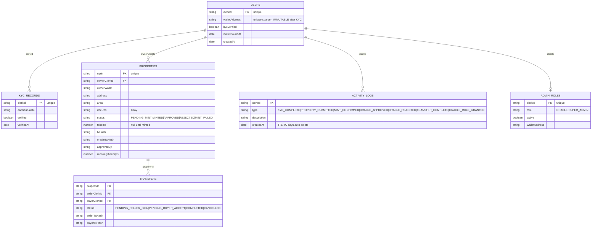

# PropChain — Database Architecture (Corrected)

## ⚡ TRUST BOUNDARY

> Everything above = MongoDB collections (CACHE ONLY)
>
> ════════════════════════════════════
> TRUST BOUNDARY — On-chain is authority
> ════════════════════════════════════
>
> **PropertyNFT.sol (ERC-721) — Source of Truth**
> - `mintProperty(ulpin, ipfsHash, address, areaSqFt)`
> - `approveProperty(tokenId)` → ORACLE_ROLE only ⚡
> - `rejectProperty(tokenId)` → ORACLE_ROLE only ⚡
> - `transferProperty(tokenId, to)`
> - `hasRole(ORACLE_ROLE, wallet)` → bool ⚡
>
> CANONICAL for: role grants, property ownership, approval state
> MongoDB MIRRORS for: querying, display, filtering only

## Index Strategy

| Collection | Field | Type |
|---|---|---|
| users | clerkId | unique |
| users | walletAddress | unique sparse |
| kyc_records | clerkId | unique |
| properties | ulpin | unique |
| properties | status | standard |
| properties | ownerClerkId | standard |
| properties | tokenId | unique sparse |
| activity_logs | clerkId | standard |
| activity_logs | createdAt | TTL (90 days) |
| admin_roles | clerkId | unique |
| admin_roles | role | standard |
| transfers | propertyId | standard |
| transfers | sellerClerkId | standard |

## Legend

| Symbol | Meaning |
|---|---|
| Solid arrow `──►` | mandatory / trusted call |
| Dashed arrow `- -►` | cache write / best-effort |
| ⚡ | On-chain verification (never skip) |
| `~` | MongoDB mirror (not authoritative) |
| `[AUTHORITY]` | Source of truth |
| `[CACHE ONLY]` | Display layer only |
