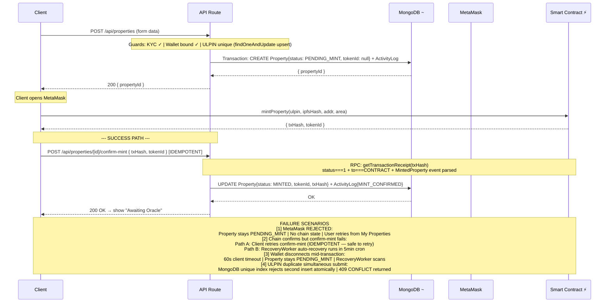

# PropChain — Mint Flow + Failure Handling (Corrected)

## Legend

| Symbol | Meaning |
|---|---|
| Solid arrow `──►` | mandatory / trusted call |
| Dashed arrow `- -►` | cache write / best-effort |
| ⚡ | On-chain verification (never skip) |
| `~` | MongoDB mirror (not authoritative) |
| `[AUTHORITY]` | Source of truth |
| `[CACHE ONLY]` | Display layer only |
