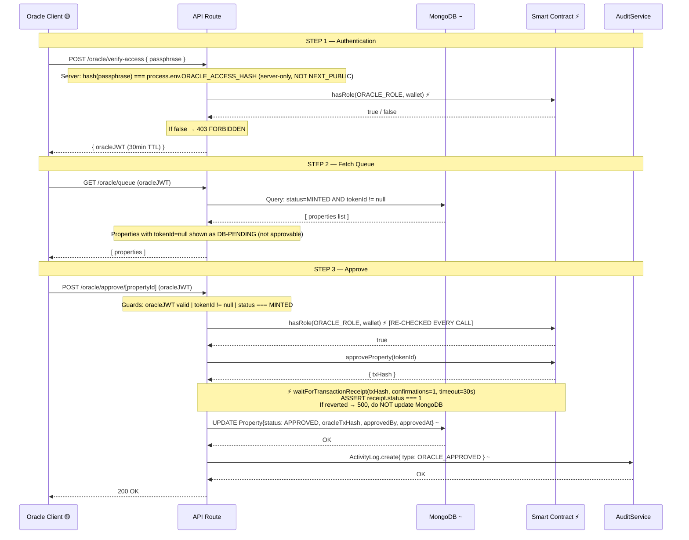

# PropChain — Oracle Approval Flow (Corrected)

## Critical Guards

| # | Guard |
|---|---|
| [1] | `ORACLE_ACCESS_HASH` is server-only env var (NOT `NEXT_PUBLIC_`) |
| [2] | `hasRole(ORACLE_ROLE, wallet)` called on EVERY approval — never trust DB cache |
| [3] | `tokenId === null` blocks on-chain call — shown as DB-PENDING |
| [4] | MongoDB update happens AFTER `receipt.status===1` — never on txHash alone |
| [5] | `oracleJWT` expires 30min — Oracle must re-authenticate |

## Legend

| Symbol | Meaning |
|---|---|
| Solid arrow `──►` | mandatory / trusted call |
| Dashed arrow `- -►` | cache write / best-effort |
| ⚡ | On-chain verification (never skip) |
| `~` | MongoDB mirror (not authoritative) |
| `[AUTHORITY]` | Source of truth |
| `[CACHE ONLY]` | Display layer only |
