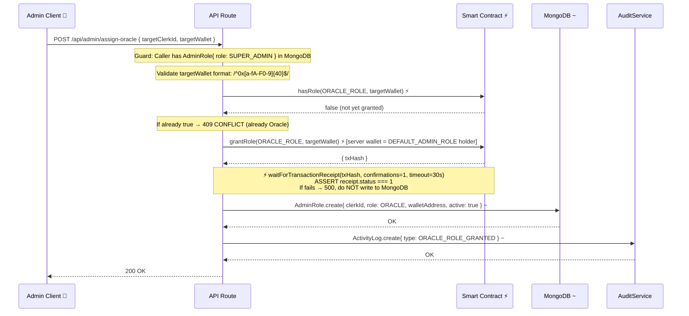

# PropChain — Oracle Role Assignment Flow (NEW)

> ⚡ MongoDB AdminRole write happens ONLY AFTER on-chain grantRole receipt confirms.
> If on-chain grant fails → MongoDB is NOT written. On-chain is always first.
> DB is a trailing cache — it never leads the on-chain state.

## Failure Paths

| # | Scenario | Outcome |
|---|---|---|
| [1] | `grantRole` tx reverts | 500 returned, MongoDB untouched |
| [2] | `waitForTransactionReceipt` timeout (30s) | 500 returned, MongoDB untouched |
| [3] | MongoDB write fails after on-chain success | Log error, return 200 with warning — on-chain role IS granted, DB cache failure does not undo on-chain state |

## Legend

| Symbol | Meaning |
|---|---|
| Solid arrow `──►` | mandatory / trusted call |
| Dashed arrow `- -►` | cache write / best-effort |
| ⚡ | On-chain verification (never skip) |
| `~` | MongoDB mirror (not authoritative) |
| `[AUTHORITY]` | Source of truth |
| `[CACHE ONLY]` | Display layer only |
