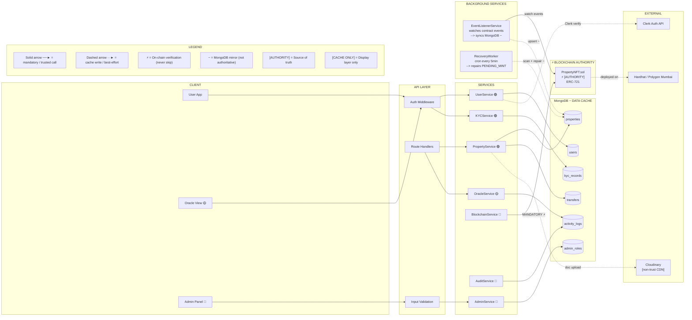

# PropChain — Corrected System Architecture

```mermaid
flowchart LR
  subgraph CLIENT["CLIENT"]
    UserApp["User App"]
    OracleView["Oracle View 🟡"]
    AdminPanel["Admin Panel 🔴"]
  end

  subgraph API_LAYER["API LAYER"]
    AuthMiddleware["Auth Middleware"]
    RouteHandlers["Route Handlers"]
    InputValidation["Input Validation"]
  end

  subgraph SERVICES["SERVICES"]
    UserService["UserService 🟣"]
    KYCService["KYCService 🟣"]
    PropertyService["PropertyService 🟣"]
    OracleService["OracleService 🟡"]
    BlockchainService["BlockchainService 🔵"]
    AuditService["AuditService 🩷"]
    AdminService["AdminService 🔴"]
  end

  subgraph DATA_CACHE["MongoDB ~ DATA CACHE"]
    UsersCol[("users")]
    KYCCol[("kyc_records")]
    PropertyCol[("properties")]
    TransferCol[("transfers")]
    ActivityCol[("activity_logs")]
    AdminRoleCol[("admin_roles")]
  end

  %% ═══ TRUST BOUNDARY — On-chain is authority below this line ═══

  subgraph BLOCKCHAIN_AUTHORITY["⚡ BLOCKCHAIN AUTHORITY"]
    SmartContract["PropertyNFT.sol\n⚡ [AUTHORITY]\nERC-721"]
  end

  subgraph EXTERNAL["EXTERNAL"]
    ClerkAPI["Clerk Auth API"]
    HardhatPolygon["Hardhat / Polygon Mumbai"]
    CloudinaryExt["Cloudinary\n[non-trust CDN]"]
  end

  subgraph BACKGROUND_SERVICES["BACKGROUND SERVICES"]
    EventListener["EventListenerService\nwatches contract events\n--> syncs MongoDB ~"]
    RecoveryWorker["RecoveryWorker\ncron every 5min\n--> repairs PENDING_MINT"]
  end

  UserApp --> AuthMiddleware
  OracleView --> AuthMiddleware
  AdminPanel --> InputValidation
  AuthMiddleware --> UserService
  AuthMiddleware --> KYCService
  RouteHandlers --> PropertyService
  RouteHandlers --> OracleService
  InputValidation --> AdminService
  UserService --> UsersCol
  KYCService --> KYCCol
  PropertyService --> PropertyCol
  PropertyService --> TransferCol
  OracleService --> ActivityCol
  AuditService --> ActivityCol
  AdminService --> AdminRoleCol
  BlockchainService -->|"MANDATORY ⚡"| SmartContract
  UserService -.->|"Clerk verify"| ClerkAPI
  SmartContract -.->|"deployed on"| HardhatPolygon
  PropertyService -.->|"doc upload"| CloudinaryExt
  EventListener -->|"watch events"| SmartContract
  EventListener -.->|"upsert ~"| PropertyCol
  RecoveryWorker -.->|"scan + repair ~"| PropertyCol

  subgraph LEGEND["LEGEND"]
    L1["Solid arrow ──► = mandatory / trusted call"]
    L2["Dashed arrow - -► = cache write / best-effort"]
    L3["⚡ = On-chain verification (never skip)"]
    L4["~ = MongoDB mirror (not authoritative)"]
    L5["[AUTHORITY] = Source of truth"]
    L6["[CACHE ONLY] = Display layer only"]
  end
```
